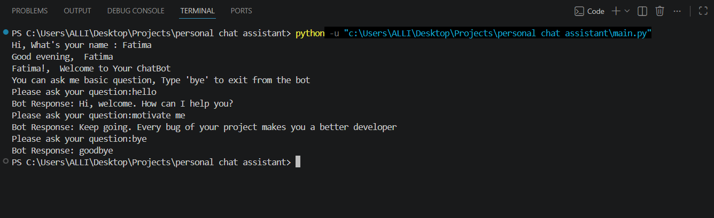

# 🤖Rule-Based AI ChatBot
A simple Rule-Based AI ChatBot built using Python. The chatbot interacts with users by responding to predefined questions and greetings. It also provides personalized greetings based on the current time of day and continues the conversation until the user types "bye".

## Features
- Personalized greeting using the user's name
- Time-based greetings (Morning, Afternoon, Evening, Night)
- Rule-based responses using a Python dictionary
- Handles common questions and greetings
- Continuous conversation loop
- Exit the chatbot by typing "bye"
## Technologies Used
- Python
- Dictionary Data Structure
- Functions
- Loops
- Conditional Statements
- Date and Time Module
## What I Learned
- Python Functions
- Dictionaries and Key-Value Pairs
- While Loops
- Conditional Statements (if-elif-else)
- User Input Handling
- String Manipulation
- Working with the DateTime Module
## 💡 Sample Conversation
Bot: Hi, What's your name : 

User: Fatima

Bot: Good evening,  Fatima

Fatima! Welcome to Your ChatBot

You can ask me basic question, Type 'bye' to exit from the bot.

User: hello

Bot: Hi, welcome. How can I help you?

User: motivate me

Bot: Keep going. Every bug of your project makes you a better developer

User: bye

Bot: goodbye
## Screenshot:
